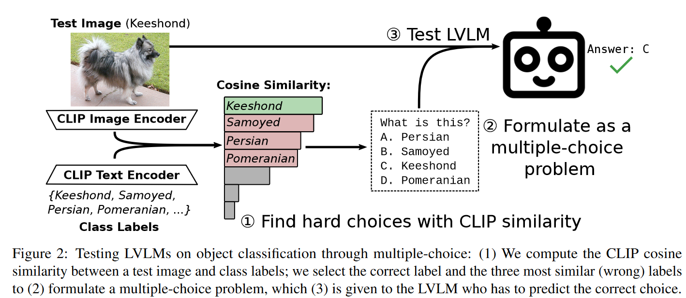

# FOCI - Benchmark for Fine-grained Object ClassIfication of LVLMs
The is the repository for our work [African or European Swallow? Benchmarking Large Vision-Language Models for Fine-Grained Object Classification
](TODO).

## About
We present **FOCI**, a benchmark for Fine-grained Object ClassIfication for large vision language models (LVLMs).

FOCI takes existing image classification datasets and turns them into unambigious multiple-choice problems.



## Using the Benchmark

### 1. Preparing the Data
Before starting, you will have to download & prepare the image datasets you want to use.
We provide a guide [here](DATA.md)


### 2. Preparing the Environment
We recommend at least Python >=3.9. 
Requirements can be found in [requirements.txt](requirements.txt). 
We used PyTorch 2.2.1 but older/newer version are likely to work, too.

### 3. Running the Benchmark

We provide a simple CLI to run the benchmark that can be called like this:

````
python run_ic_bench.py \
--model=google/paligemma-3b-mix-224 \
--dataset=stanford_cars \
--prompt_query='Which of these cars is shown in the image?' \
--image_root=/media/gregor/cache1/icbench/stanfordcars/stanford_cars \
````

Available datasets are `imagenet, imagenet-rendition, imagenet-adversarial, imagenet-sketch, food101, flowers102, fgvc_aircraft, stanford_cars, oxford_pet, geode, imagenet-6k-{animal|plant|food|artifact}`.

See our [scripts](scripts) for more examples.

### 4. Evaluating Results

We provide a [notebook](evaluation/evaluate.ipynb) for easy evaluation of the results produced by the CLI.


### 5. Bonus: Testing New Models

Our code is trivial to extend to new models (especially if they use Hugging Face):

1. Implement your model based on the reference [HfModel](benchmark/model/model.py) or the other already implemented models.
2. Update [model_template()](benchmark/data/dataset.py) to provide your models instruction template.
3. Update [load_model()](benchmark/model/model.py) to load your model based on the name.

### 6. Bonus: Testing on New Datasets

Our code is also trivial to extend to new image classification datasets:

1. Implement a loader function that creates a dictionary mapping labels to (relative) image paths and add it to [DATASET_TO_LOADER](benchmark/data/dataset.py).
2. Done. When running the benchmark for the first time, we use CLIP to find difficult multiple-choice options and store them in [data](data) for subsequent runs.


## License & Citation

This work is licensed under the MIT license. Third-party software and data are subject to their respective licenses.

If you find our code/data/models or ideas useful in your research, please consider citing the paper:

````
@article{geigle2024foci,
  author       = {Gregor Geigle and
                  Radu Timofte and
                  Goran Glava\v{s}},
  title        = {African or European Swallow? Benchmarking Large Vision-Language Models for Fine-Grained Object Classification},
  journal      = {arXiv},
  volume       = {abs/TODO},
  year         = {2024},
  url          = {https://arxiv.org/abs/TODO},
  eprinttype   = {arXiv},
  eprint       = {TODO},
}
````